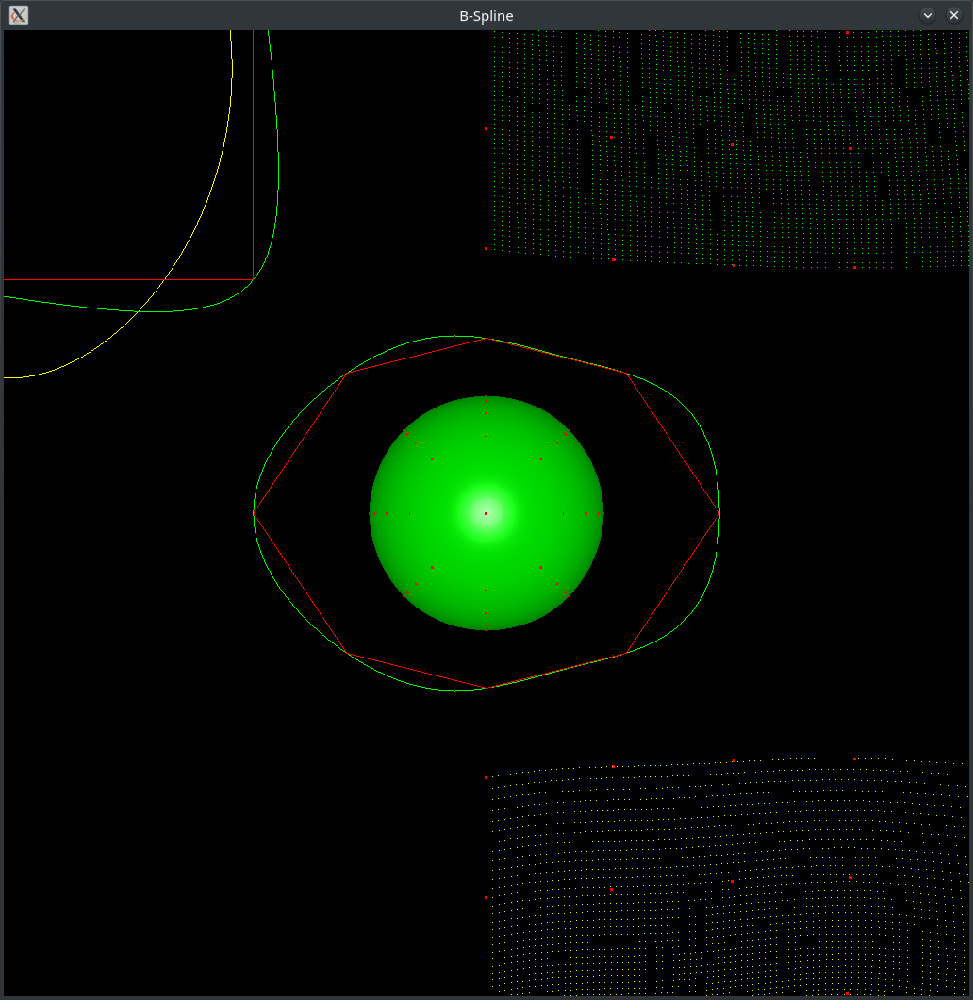

`B Spine`
==========================================
## 简介
    本项目实现了B样条曲线和曲面的插值和拟合
## 配置
    使用cmake管理项目，可以linux(manjaro)和windows10上编译成功并运行
    cmake 3.17 or newer
    c++ 14
## 第三方库依赖
    1.SDL2
    2.glm
    3.glad
    4.eigen
## 注意
    绘制曲面时 必须要有法向量数据，否则绘制结果不正确
    main.cpp 主要是用于创建控制点、得到B样条的结果采样点以及添加绘制对象，如果要测试，请在该处修改
## 结果

